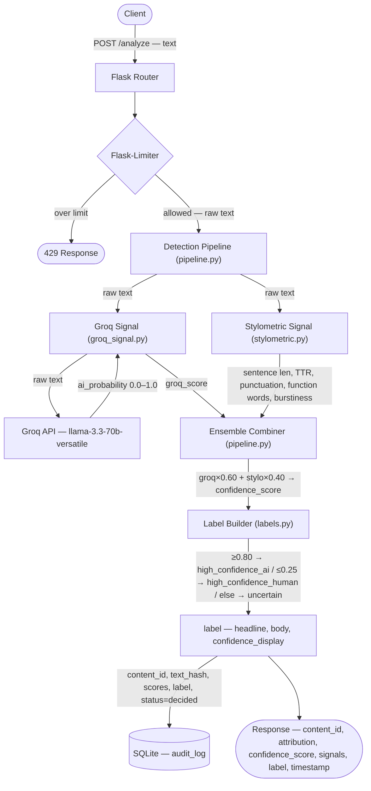
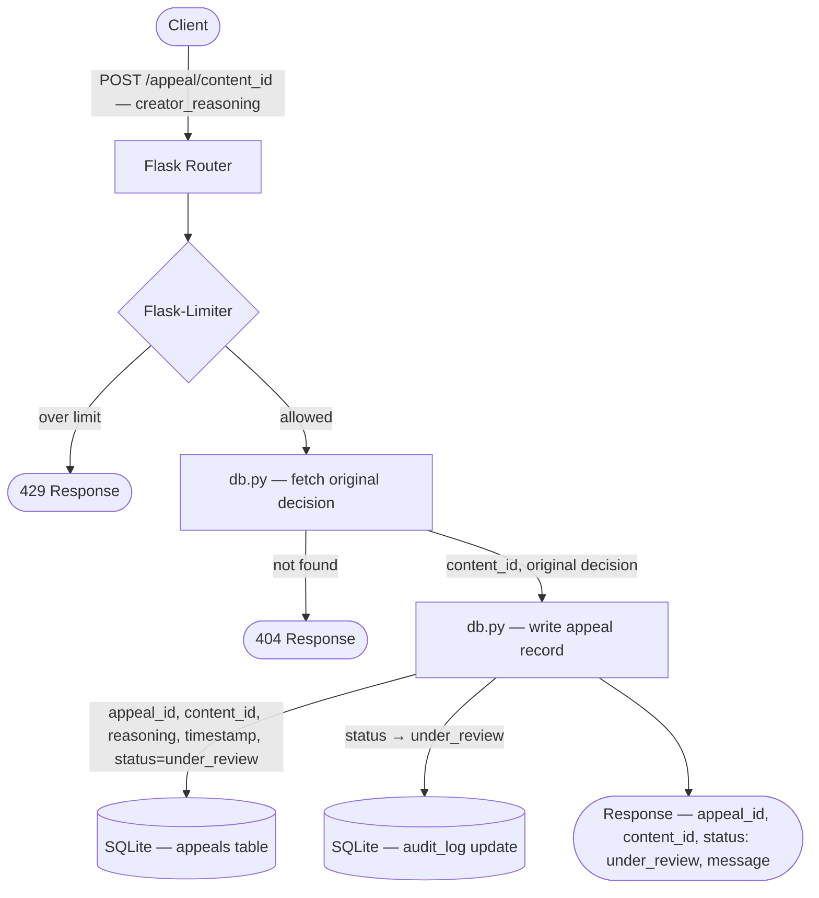

# Provenance_Guard — planning.md

---

## 1. Architecture Narrative

A piece of text enters the system via `POST /analyze`. Flask receives the request and immediately hands it to Flask-Limiter, which checks whether this IP has exceeded the rate limit (10 requests/minute, 100/day). If over limit, request dies here with 429.

If allowed, Flask extracts the `text` field and passes it to the **Detection Pipeline** (`detection/pipeline.py`). The pipeline runs two signals in sequence (or parallel — order doesn't matter since they're independent):

**Signal 1 — Groq LLM Classifier** (`detection/groq_signal.py`): The raw text is sent to `llama-3.3-70b-versatile` via the Groq API with a system prompt instructing the model to return a JSON object containing `ai_probability` (0.0–1.0) and `reasoning`. The model acts as a semantic judge — it has internalized what AI-generated prose patterns look like across thousands of examples. Returns a float between 0 and 1.

**Signal 2 — Stylometric Heuristics** (`detection/stylometric.py`): The raw text is analyzed for five statistical properties: average sentence length, type-token ratio (vocabulary diversity), punctuation density, function word frequency, and sentence-length burstiness (standard deviation of sentence lengths). Each property is scored against empirically tuned thresholds, then combined into a single probability estimate. Returns a float between 0 and 1.

**Ensemble Combiner** (`detection/pipeline.py`): Both signal scores are combined via weighted average — Groq gets 60% weight, stylometrics 40%. The result is the `confidence_score` (probability of AI authorship, 0.0–1.0).

**Label Builder** (`labels.py`): The confidence score maps to one of three transparency label variants. The label encodes both the attribution result and communicates uncertainty to a non-technical reader.

**Audit Logger** (`db.py`): Before returning the response, the system writes a structured record to SQLite: content hash, confidence score, both signal scores, label text, timestamp, and status (`"decided"`).

**Response**: Flask serializes and returns the structured JSON response to the caller — attribution result, confidence score, label object, and a unique `content_id` the creator can use to appeal.

---

## 2. Detection Signals

### Signal 1: Groq LLM Semantic Classifier

**What it measures:** Semantic and structural patterns in the text — fluency, coherence, topic consistency, sentence variety at the meaning level, characteristic phrasing patterns associated with large language models.

**Why it differs between human and AI writing:** LLMs optimize for plausibility given context. This produces writing that is semantically coherent but statistically "too smooth" — rare words appear in expected contexts, transitions are always logical, no jarring tonal shifts. Human writers introduce personal voice, digress, use idioms inconsistently, and make micro-decisions that reflect lived experience rather than token prediction.

**Blind spots:** The model can be fooled by AI-generated text that deliberately mimics human imperfection. It also struggles with highly technical writing (documentation, academic abstracts) where humans *should* sound uniform. A non-native English writer may produce text the model rates as "suspiciously fluent." The model has no memory of what "this author usually writes like" — it judges in isolation. Rate limits and API latency are operational blind spots.

---

### Signal 2: Stylometric Heuristics

**What it measures:** Five surface-level statistical properties of the text:
1. **Average sentence length** — AI tends toward medium-length sentences; humans have more extremes
2. **Type-token ratio (TTR)** — vocabulary diversity; AI text on a topic tends to reuse the same vocabulary
3. **Punctuation density** — AI uses punctuation very consistently; human writers overuse or underuse
4. **Function word frequency** — words like "however," "therefore," "notably" appear at characteristic AI rates
5. **Burstiness** — standard deviation of sentence lengths; human writing is more bursty, AI more uniform

**Why it differs between human and AI writing:** LLMs are trained to minimize perplexity. This produces statistical regularity that doesn't appear in human writing. Humans write with attention fatigue, stylistic habits, and emotional state variation — all of which create statistical noise that stylometrics can detect.

**Blind spots:** Short texts (< 100 words) don't have enough data for reliable statistics — TTR is unreliable below ~150 tokens. Heavily edited human writing (professional journalism, polished essays) can appear "AI-like" on surface statistics. Conversely, deliberately sloppy AI output (instructed to add typos, vary sentence length) can defeat heuristics entirely. Stylometrics sees the surface; it cannot see meaning.

---

## 3. False Positive Problem

**Scenario:** A human writer submits a polished, carefully edited blog post. They write in a clear, structured style — consistent paragraph length, logical transitions, varied but not extreme vocabulary. This is good writing. It is also statistically similar to AI output.

**What happens in the system:**
- Groq signal: returns `0.72` — the model finds the text "suspiciously coherent" and flags uncertainty
- Stylometrics signal: returns `0.65` — burstiness is low, function word frequency is in AI range
- Ensemble: `0.72 × 0.60 + 0.65 × 0.40 = 0.692` — rounds to `0.69`
- This score lands in the **uncertain zone** (0.26–0.79)

**What the label says:** The system does NOT say "this is AI-generated." It says the uncertain variant — something like: *"Our system found mixed signals in this content (confidence: 69%). We can't confidently determine authorship. If this is your original work, you can submit an appeal below."*

**Why this matters for design decisions:**
- The confidence score must be visible in the label — "69% confidence" means something different to a creator than "AI detected"
- The uncertain zone must be wide, not narrow. Better to under-label than to falsely accuse.
- The appeal flow must be low-friction — a creator in this situation needs a clear, obvious path to contest
- Appeals must be logged alongside the original decision so a human reviewer can see the full picture

**Appeal flow for this scenario:** Creator calls `POST /appeal/<content_id>` with their reasoning ("I wrote this myself — here's my draft history"). System logs the appeal, sets status to `"under_review"`, and returns confirmation. No automated re-classification. A human reviews it.

---

## 4. API Contract

### POST /analyze
**Accepts:**
```json
{
  "text": "string (required, 50–10000 chars)",
  "author_id": "string (optional, for appeal linkage)"
}
```
**Returns:**
```json
{
  "content_id": "uuid",
  "attribution": "ai | human | uncertain",
  "confidence_score": 0.0,
  "signals": {
    "groq": 0.0,
    "stylometric": 0.0
  },
  "label": {
    "headline": "string",
    "body": "string",
    "confidence_display": "string"
  },
  "timestamp": "ISO8601"
}
```
**Errors:** 429 rate limit, 400 missing/invalid text, 503 Groq unavailable (fallback: stylometric-only mode)

---

### POST /appeal/\<content_id\>
**Accepts:**
```json
{
  "creator_reasoning": "string (required)",
  "contact": "string (optional email)"
}
```
**Returns:**
```json
{
  "appeal_id": "uuid",
  "content_id": "uuid",
  "status": "under_review",
  "message": "string"
}
```
**Errors:** 404 content_id not found, 400 missing reasoning, 429 rate limit (5/hour)

---

### GET /log
**Accepts:** Query params: `limit` (default 50), `offset` (default 0)
**Returns:**
```json
{
  "entries": [
    {
      "content_id": "uuid",
      "timestamp": "ISO8601",
      "attribution": "ai | human | uncertain",
      "confidence_score": 0.0,
      "signals": { "groq": 0.0, "stylometric": 0.0 },
      "status": "decided | under_review | resolved",
      "appeal": { ... } | null
    }
  ],
  "total": 0
}
```

---

## 5. Architecture Diagrams

### Flow 1: Submission



---

### Flow 2: Appeal



---

## 6. Transparency Label Text (3 Variants)

**High-confidence AI** (score ≥ 0.80):
> "Our system is highly confident this content was AI-generated (confidence: {score}%). This content has been labeled accordingly. If you are the author and believe this is incorrect, you may submit an appeal."

**High-confidence Human** (score ≤ 0.25):
> "Our system is highly confident this content was written by a human (confidence: {100-score}%). No AI attribution label has been applied."

**Uncertain** (score 0.26–0.79):
> "Our system found mixed signals in this content and cannot confidently determine authorship (confidence: {score}% AI likelihood). No definitive label has been applied. If this is your original work, you may submit an appeal to have it reviewed."

---

## 7. Rate Limit Reasoning

- `POST /analyze` — **10/minute, 100/day per IP**
  - 10/min: prevents scripted bulk-submission abuse; a human user doesn't need more than 1–2/min
  - 100/day: maps to Groq free tier capacity; keeps API costs at zero
- `POST /appeal` — **5/hour per IP**
  - Appeals require human review; flood prevention; 5/hour is generous for legitimate use

---

## 8. Tech Stack

| Component | Technology | Reason |
|---|---|---|
| API framework | Flask | Lightweight, no overhead |
| Signal 1 | Groq (`llama-3.3-70b-versatile`) | Free tier, strong semantic detection |
| Signal 2 | Stylometric heuristics | Pure Python, zero dependencies, fast |
| Rate limiting | Flask-Limiter | Native Flask integration |
| Audit log | SQLite (`db.py`) | Built-in, supports appeals + status updates |

---

## 9. Build Order (Milestone 2)

1. `db.py` — schema, insert/query functions
2. `detection/stylometric.py` — no API dependency, fully testable offline
3. `detection/groq_signal.py` — needs `.env` with `GROQ_API_KEY`
4. `detection/pipeline.py` — ensemble combiner
5. `labels.py` — label builder
6. `app.py` — Flask routes, limiter config
7. `.env.example`
8. Manual test: 3 known-AI texts, 3 known-human texts → verify scores make sense
